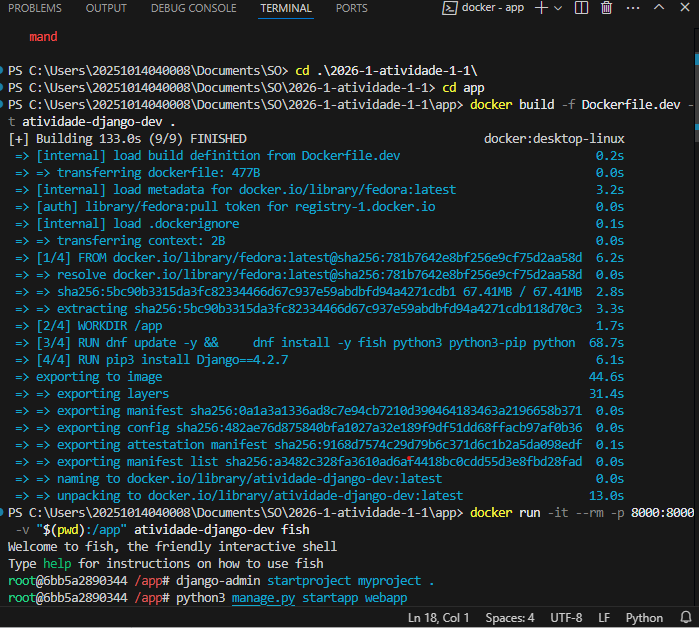
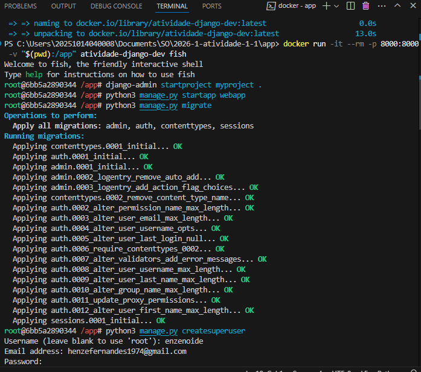
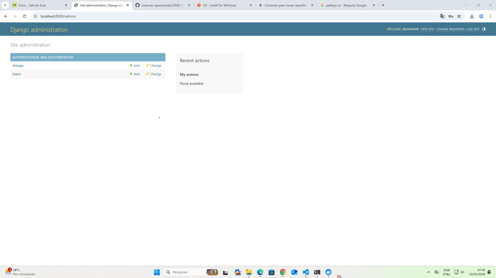
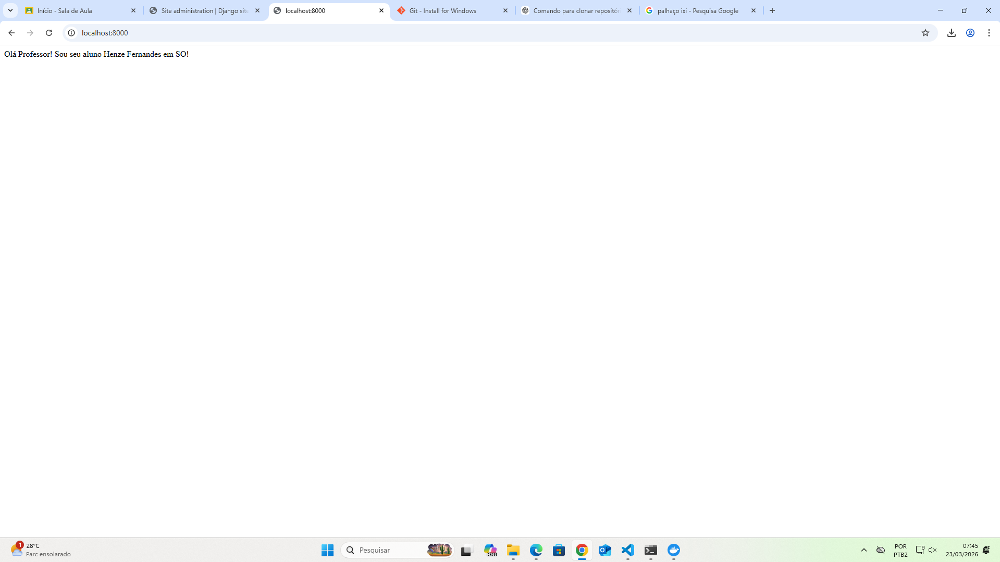

# Atividade Docker - Henze Fernandes Pinto

## Introdução
Esta atividade foi desenvolvida como parte da avaliação da disciplina de **Sistemas Operacionais**. O objetivo central é a criação e configuração de um ambiente de desenvolvimento isolado utilizando **Docker** para uma aplicação web utilizando o framework **Django**. 

A utilização de containers permite que a aplicação seja executada de forma consistente em diferentes máquinas, garantindo que todas as dependências (como Python, SQLite e o próprio Django) estejam corretamente configuradas sem interferir no sistema operacional hospedeiro, facilitando a portabilidade e a gerência de recursos do sistema.

---

## Relato das Atividades

O processo foi dividido em quatro etapas principais, detalhadas a seguir:

### 1. Preparação do Projeto
Nesta etapa inicial, foi estabelecido o ambiente de versionamento e a estrutura de pastas necessária para o container.
* **Fork e Clone:** O repositório base foi "forkado" e clonado para a máquina local.
* **Estrutura de Pastas:** Foi criada a pasta `app/` para concentrar o código-fonte da aplicação.
* **Requisitos:** Criado o arquivo `app/requirements.txt` contendo a dependência `Django==4.2.7`.

### 2. Criação da Imagem Docker e Execução do Container
Definição do ambiente operacional via arquivo de configuração.
* **Dockerfile.dev:** Foi criado um arquivo utilizando o **Fedora** como imagem base, configurando o `WORKDIR /app`, instalando as dependências do sistema (Python, Pip, GCC, SQLite) e o Django.
* **Build da Imagem:** Executado o comando no terminal:
  `docker build -f Dockerfile.dev -t atividade-django-dev .`
* **Execução com Volume Mapeado:** O container foi iniciado em modo interativo com o shell `fish`, mapeando a porta 8000 e criando um volume para sincronizar os arquivos em tempo real:
  `docker run -it --rm -p 8000:8000 -v "$(pwd):/app" atividade-django-dev fish`

> ****

### 3. Criar e Configurar a Aplicação Django
Com o terminal do container ativo, as tarefas de desenvolvimento foram realizadas:
* **Criação do Projeto:** `django-admin startproject myproject .`
* **Criação da App:** `python3 manage.py startapp webapp`
* **Configuração de Banco de Dados:** Verificação do SQLite3 no `settings.py`.
* **Ajustes no Settings:** Adição da `webapp` em `INSTALLED_APPS` e configuração de `ALLOWED_HOSTS = ['*']`.
* **Migrações e Admin:** Executado o `migrate` para criar as tabelas e o `createsuperuser` para o acesso administrativo (User: admin / Pass: 321).
* **Desenvolvimento da View:** Edição do arquivo `webapp/views.py` para exibir a mensagem: *"Olá Professor! Sou seu aluno Henze Fernandes Pinto em SO!"*.
* **Configuração de URLs:** Mapeamento das rotas tanto no arquivo do app quanto no do projeto principal.

> ****

### 4. Executar e Acessar a Aplicação
* **Inicialização do Servidor:** Executado o comando `python3 manage.py runserver 0.0.0.0:8000`.
* **Testes no Navegador:** * Acesso à home: `http://localhost:8000`
    * Acesso ao Admin: `http://localhost:8000/admin`

> ****

> ****
---

## Considerações Finais

### Aprendizado
O maior aprendizado foi entender a dinâmica de **volumes mapeados**. Perceber que eu posso editar o código no meu VS Code (hospedeiro) e ver o resultado imediato dentro de um container rodando Fedora foi muito interessante. Além disso, a prática reforçou os conceitos de isolamento de processos e redes em sistemas operacionais modernos.

### Dificuldades
A principal dificuldade foi garantir que o comando do Docker Build encontrasse o arquivo de requisitos corretamente e a configuração do `ALLOWED_HOSTS`, que é um erro comum quando se sobe uma aplicação Django em ambientes virtualizados ou containers pela primeira vez.
